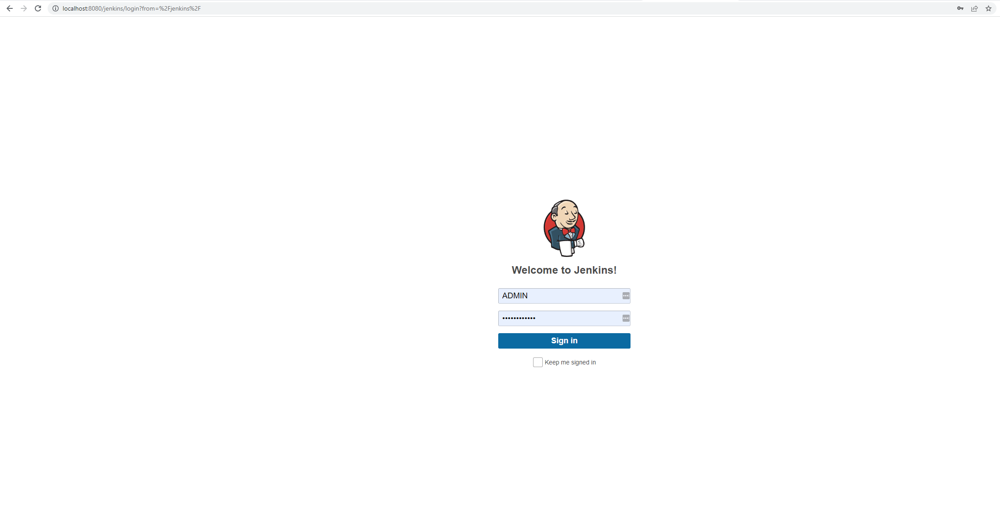

# Jenkins on Kubernetes 

This repo is a tutorial on how to deploy jenkins on a kubernetes cluster. 

## Requirements

You will need an AWS account with credentials and needed permissions to deploy a EKS cluster. Setting awscli is scope out of this tutorial.

- eksctl
- awscli
- Helm 3

## Create EKS cluster using EKSCTL

Create an EKS cluster. Feel free to update cluster.yaml if you want to.

```sh
eksctl create cluster -f cluster.yaml
```

Once the cluster is ready, we are going to need to get the kubeconfig of our cluster.

```sh
aws eks update-kubeconfig --name eksctl-cluster --alias EKStutorial
```

### Installing nginx ingress on AWS EKS

```
kubectl apply -f https://raw.githubusercontent.com/kubernetes/ingress-nginx/controller-v1.2.0/deploy/static/provider/aws/deploy.yaml
```

### Get Jenkins Helm Chart

```sh
helm repo add jenkins https://charts.jenkins.io
helm repo update
```

### Get Chart default values (optional)

```sh
helm show values jenkins/jenkins > values.yaml
```

 ### Custom Jenkins Image on AWS ECR

Login to AWS ECR registry. Make sure you get the same region of your eks cluster and your account id number

We are going to need our aws account id number.

```sh
aws_account_id=$(aws sts get-caller-identity --query "Account" --output text)
```
and region.

```sh
aws_region=<region> #select your region, I'm using us-east-1 most of the time
```

```sh
aws ecr get-login-password --region $aws_region | docker login --username AWS --password-stdin $aws_account_id.dkr.ecr.$aws_region.amazonaws.com
```

Lets create our Jenkins repository.
```
aws ecr create-repository --repository-name jenkins
```

We are going to build our custom jenkins image with our required plugins
```sh
docker build -t <aws_account_id>.dkr.ecr.<region>.amazonaws.com/jenkins .
docker push <aws_account_id>.dkr.ecr.<region>.amazonaws.com/jenkins
```

### Helm install Jenkins

Make sure your custom image gets updated in the value file

```sh
kubectl create namespace jenkins
helm install jenkins jenkins/jenkins -n jenkins -f jenkins-values.yaml
```

### Accesing Jenkins
Get ingress elb dns name

```sh
kubectl get svc -n ingress-nginx
```
You will be able to access Jenkins in the browser, for example:

>https://a52d9768bea6945eaaac18d0629319e6-70290933fced4aa7.elb.us-east-1.amazonaws.com/jenkins

And once in the login page, get the admin password with the following command

```sh
kubectl exec --namespace jenkins -it svc/jenkins -c jenkins -- /bin/cat /run/secrets/chart-admin-password && echo
```


